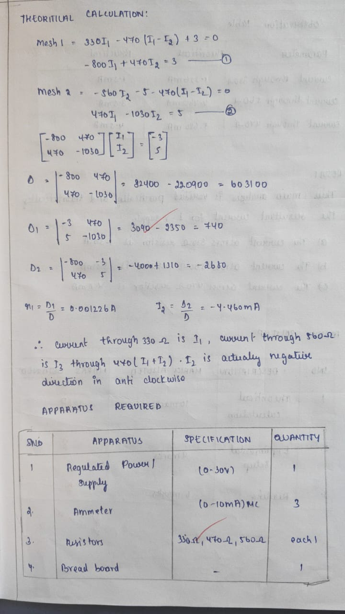

# 2.DETERMINATION-OF-CURRENT-IN-CIRCUIT-USING-MESH-ANALYSIS

**AIM:**

*To determine the current in circuit using mesh analysis both theoretically and practically for a given DC circuit.*

**APPARATUS REQUIRED:**

**SL.NO	APPARATUS	SPECIFICATION	QUANTITY**

  RegulatedPowersupply( RPS)(0-30 V)1
	
  Ammeter	( 0 - 10 mA) MC	3
	
  Resistors	330Ω,.470Ω,560Ω	Each 1
	
  Bread board	---	1

**THEORY:**

*Multi-source DC circuits may be analyzed using a mesh current technique. The process involves identifying minimum number of small loops such that every component exists in at least one loop. KVL is then applied to each loop. The loop currents are referred to as mesh currents as each current interlocks or meshes with the surrounding loop currents. As a result there will be a set of simultaneous equations created, an unknown mesh current for each loop. Once the mesh currents are determined, various branch currents and component voltages may be derived*

**CIRCUIT DIAGRAM:**

**PROCEDURE:** 

1.	Give connections as per the circuit diagram.

2.	Switch ON the supply, vary the RPS (Regulated Power Supply) and set a particular input voltage.

3.	Note down the readings of ammeters and voltmeters and tabulate them.

4.	Vary the RPS for different input voltages and note down the readings of all the meters.

5.	Reduce the RPS to its minimum value and switch OFF the supply.

6.	Using the tabulated values, verify Kirchoff’s laws practically, and verify it theoretically.

   **RESULT:**

Thus, the Mesh analysis is verified practically and theoretically. The resultant currents for  I / V supply are:

a)	The current across 330Ω resistor is	1.226 mA.

b)	The current across 560Ω resistor is	4.460 mA.

c)	The current across 470Ω resistor is	5.680 mA.

